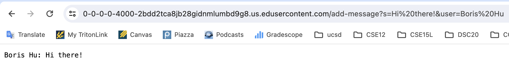
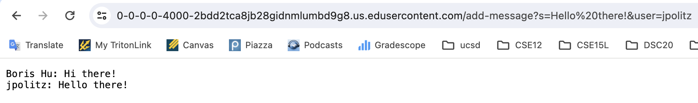
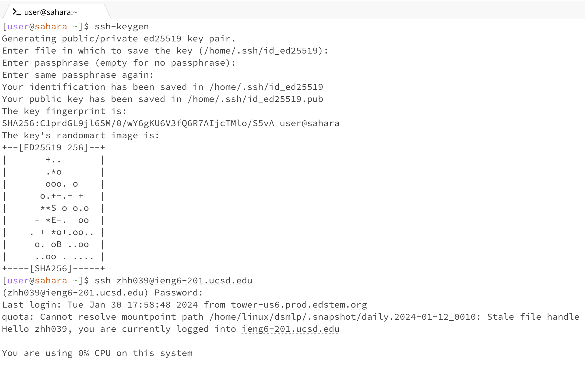
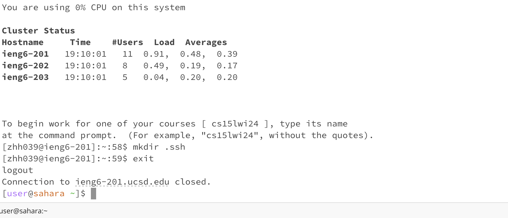
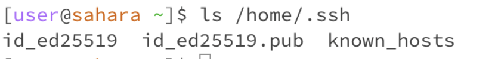
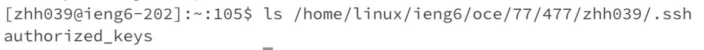
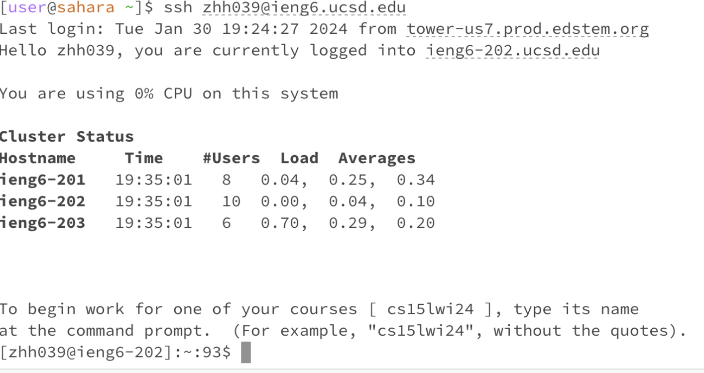

# **Lab Report 2 -- Zhenhan Hu(A17282448)**
---
# **Part 1**
## *Code for my `ChatServer`*
```
import java.io.IOException;
import java.net.URI;
import java.net.URLDecoder;
import java.io.UnsupportedEncodingException;
import java.util.ArrayList;

class Handler implements URLHandler {
    private static ArrayList<String> users = new ArrayList<String>();
    private static ArrayList<String> messages = new ArrayList<String>();

    public String handleRequest(URI url) {
        if (url.getPath().contains("/add-message")) {
            String[] parameters = url.getQuery().split("&");
            try {
                if (((parameters[0].split("="))[0]).equals("s")) {
                    // messages.add(((parameters[0].split("="))[1]));
                    messages.add(URLDecoder.decode((parameters[0].split("="))[1], "UTF-8"));
                    }
                if (((parameters[1].split("="))[0]).equals("user")) {
                    // users.add(((parameters[1].split("="))[1]));
                    users.add(URLDecoder.decode((parameters[1].split("="))[1], "UTF-8"));
                    }
            } catch (UnsupportedEncodingException e) {
                e.printStackTrace();
            }
            String user_message = "";

            for (int i = 0; i < users.size(); i++) {
                user_message = user_message + users.get(i) + ": " + messages.get(i) + "\n";
            }
            return user_message;
            // return ((parameters[1].split("="))[1]) + ": " + ((parameters[0].split("="))[1]);
        } else {
            return "404 Not Found!";
        }
    }
}

class Lab_report_2 {
    public static void main(String[] args) throws IOException {
        if(args.length == 0){
            System.out.println("Missing port number! Try any number between 1024 to 49151");
            return;
        }

        int port = Integer.parseInt(args[0]);

        Server.start(port, new Handler());
    }
}
```
Note: I used the `java.net.URLDecoder` class that decodes the URL parameters to handle the issue where "+" is displayed between spaces in the output, and catched `UnsupportedEncodingException` caused from it.

## *Screenshot 1 using `/add-message`*

Here, in class `Handler`, the method `handleRequest(URI url)` is called, and the passed-in argument for `url` is paths/query `/add-message?s=Hi%20there!&user=Boris%20Hu`. Two Array List `users` and `messages` are relative fields in class `Handler` with values that were initially assigned as empty, but after the first method call, the value "Boris Hu" is added to `users` and the value "Hi there!" is added to `messages`. The elements in `users` and `messages` are stored and later returned/displayed on the web page.

## *Screenshot 2 using `/add-message`*


Similarly, here, the method `handleRequest(URI url)` in class `Handler` is called again, but with the passed-in argument for `url` being paths/query `/add-message?s=Hello%20there!&user=jpolitz`. Two Array List `users` and `messages` are relative fields in class `Handler` with values updated with value `jpolitz` being added to `users` and value `Hello there!` being added to `messages`. The elements in `users` and `messages` are stored and later returned/displayed on the web page.

---

# **Part 2**
## *Setting up SSH Keys for logging into `ieng6` *


As the two screenshots attached above have shown, I followed each step in week 3 lab part 3 for creating SSH keys. I found the key is saved in `/home/.ssh/id_ed25519.pub`, then I created a directory using `mkdir .ssh` and copied the SSH key onto my remote account.

## *Screenshots 1: The absolute path to the *private* key*

The private key, which must be kept secure and should not be shared, should only be known to its owner, and it is usually stored in the `~/.ssh/` directory on the **local** machine. As the screenshot shows, the absolute path where it is located is `/home/.ssh`, and I used the `ls` command in the terminal to list files in that directory.

## *Screenshots 2: The absolute path to the *public* key*

Contrary to the private key, the public key is stored in the `~/.ssh/` directory on my **`ieng6`** account as `/home/linux/ieng6/oce/77/477/zhh039/.ssh` shown in the screenshot. I first connected to ieng6 and then used the `ls` command to list out the key file that visually existed in the terminal.

## *Screenshots 3: Terminal interaction when logging into my `ieng6` account*

This screenshot shows that there is no prompt for password displayed, which means I do not need to input my password when I log into my remote account anymore.

---

# **Part 3**
To be honest, before coming to CSE 15L, I did not know anything about the remote server or any related command lines from the terminal. From weeks 2 and 3, I learned how to use `scp` to copy a file to a server and use `ssh` to access the server. I also know how to use what I learned from URLs to create a web server and handle different events, and having opportunities to familized how to use VSCode environment.
