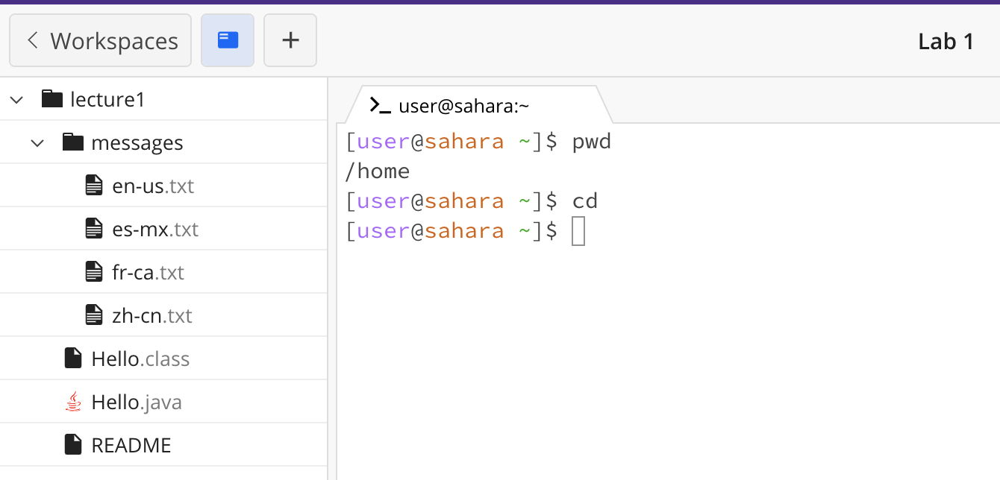
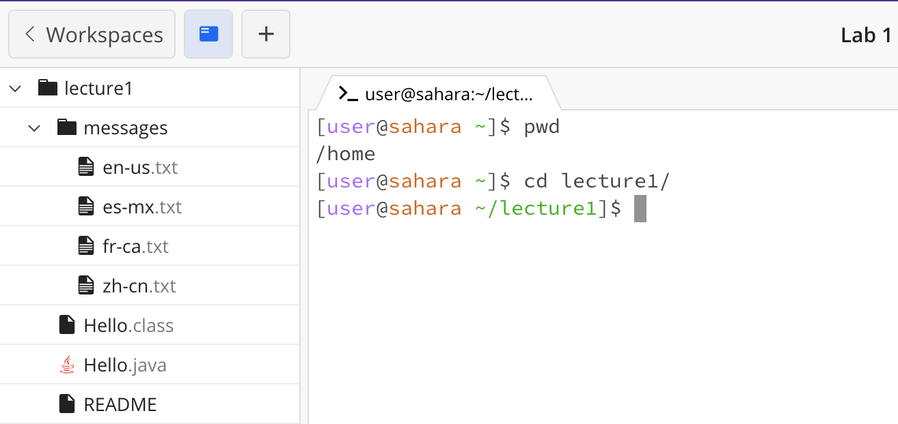
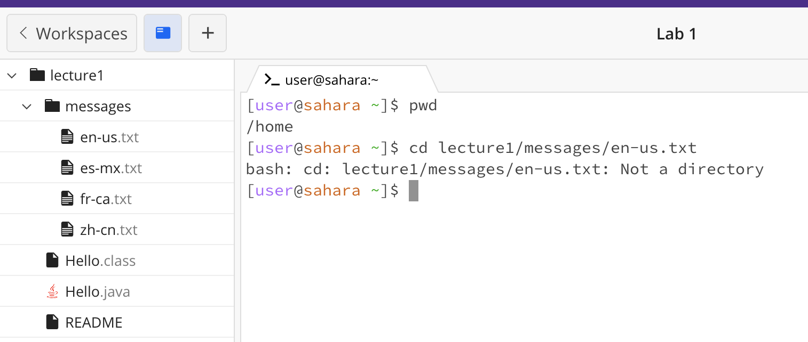
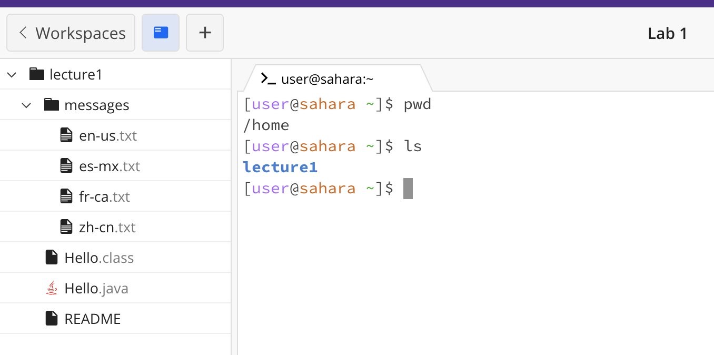
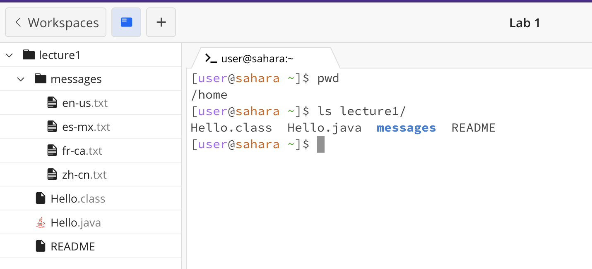
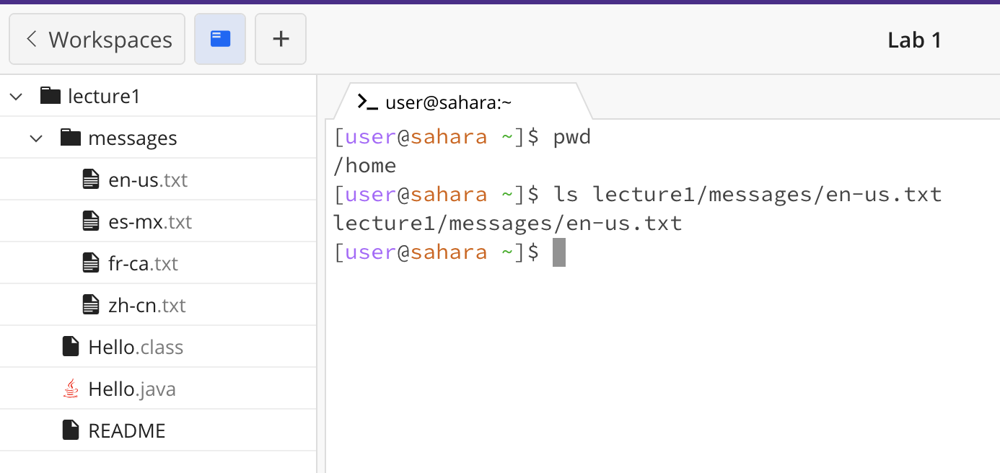
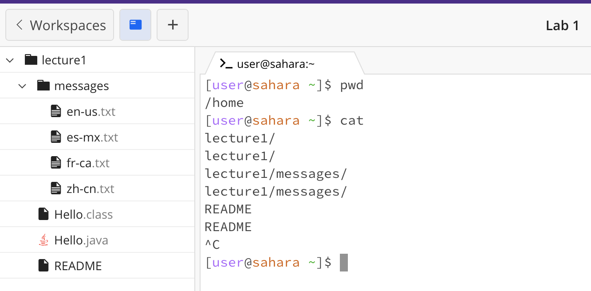
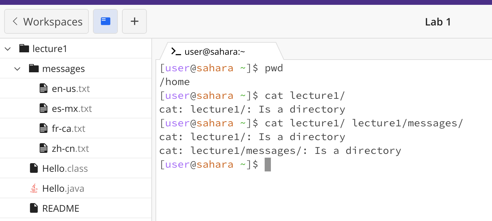
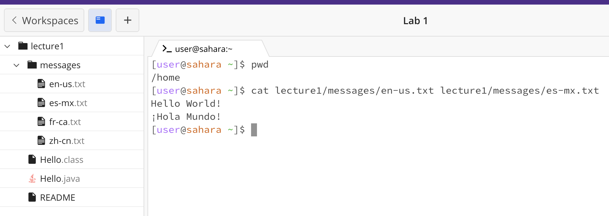

# **Lab Report 1 -- Zhenhan Hu(A17282448)**

---

##  *Example of using `cd` command with no arguments*
Here, the working directory before the command run was `/home/lecture1/messages`, and input `cd` command with no argument meaning there is no data pass into a command line command, and it changes the working directory to the `/home` directory. There is no error message shown.

##  *Example of using 'cd' command with with a path to a directory as an argument*
Here, the working directory before the command run was `/home`, and input `cd` command with a path to a directory as an argument, `lecture1/`,  changes the working directory to `/home/lecture1`, also noticed by the prefix changes to '[user@sahara ~/lecture1]$'. There is no error message shown.

##  *Example of using 'cd' command with a path to a file as an argument*
Here, the working directory before the command run was `/home`, and input `cd` command with a path to a file as an argument, `lecture1/messages/en-us.txt`, resulting an error message since `cd` is used to change directories, not files.

---

##  *Example of using 'ls' command with no arguments*
Here, the working directory before the command run was `/home`, and input `ls` command with no argument meaning there is no data pass into a command line command, and it lists the content of the current working directory, `lecture1`. There is no error message shown.

##  *Example of using 'ls' command with with a path to a directory as an argument*
Here, the working directory before the command run was `/home`, and input `ls` command with a path to a directory as an argument, `lecture1/`,  lists the contents of the specified directory, `Hello.class`, `Hello.java`, `messages`, and `README`. There is no error message shown.

##  *Example of using 'ls' command with a path to a file as an argument*
Here, the working directory before the command run was `/home`, and input `ls` command with a path to a file as an argument, `lecture1/messages/en-us.txt` outputs the argument I put, `lecture1/messages/en-us.txt`, and there is no error message shown.

---

##  *Example of using 'cat' command with no arguments*
Here, the working directory before the command run was `/home`, and input `cat` command with no argument meaning there is no data pass into a command line command, it outputs nothing initially but something still running since there is no prefix of `[user@sahara ~]$`, when I type something such as `lecture1`, `lecture1/messages`, or `README`, it simply reads from the terminal and output my keyboard input, I exit with control C. There is no error message shown.

##  *Example of using 'cat' command with with a path to a directory as an argument*
Here, the working directory before the command run was `/home`, and input `cat` command with a path to a directory, `lecture1/`, or two directories, `lecture1/`  `lecture1/messages/`, resulting error message since they are directories. The working directory remain the same.

##  *Example of using 'cat' command with a path to a file as an argument*
Here, the working directory before the command run was `/home`, and input `cat` command with a path to a file as an argument, `lecture1/messages/en-us.txt` or two files with adding "lecture1/messages/es-mx.txt " outputs the content of the specified file(s). No error message shown and working directory remain the same.

