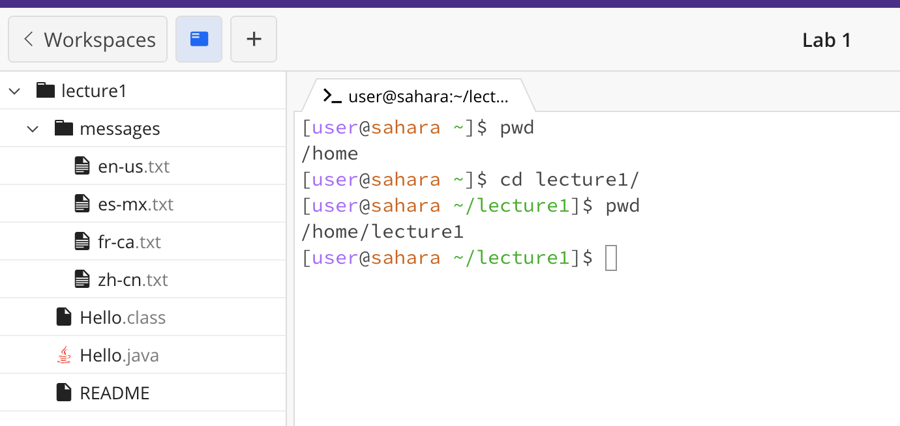

**Lab Report 1**

*Example of using 'cd' command with no arguments*
Here, the working directory before the command run was /home/lecture1/messages, and input cd command with no argument meaning there is no data pass into a command line command, and it changes the working directory to the home directory.

*Example of using 'cd' command with with a path to a directory as an argument*

*Example of using 'cd' command with a path to a file as an argument*

*Example of using 'ls' command with no arguments*

*Example of using 'ls' command with with a path to a directory as an argument*

*Example of using 'ls' command with a path to a file as an argument*

*Example of using 'cat' command with no arguments*

*Example of using 'cat' command with with a path to a directory as an argument*

*Example of using 'cat' command with a path to a file as an argument*
