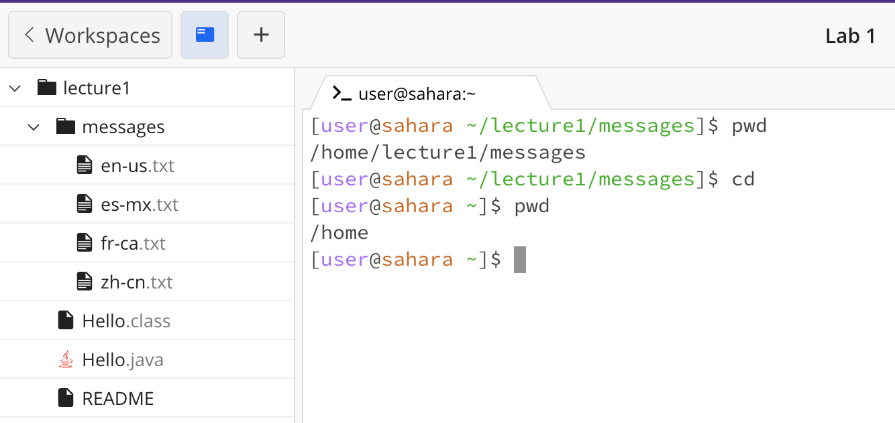

**Lab Report 1**

*Example of using `cd` command with no arguments*
Here, the working directory before the command run was `/home/lecture1/messages`, and input `cd` command with no argument meaning there is no data pass into a command line command, and it changes the working directory to the `/home` directory. There is no error message shown.

*Example of using 'cd' command with with a path to a directory as an argument*
Here, the working directory before the command run was `/home`, and input `cd` command with a path to a directory as an argument, `lecture1/`,  changes the working directory to `/home/lecture1`. There is no error message shown.

*Example of using 'cd' command with a path to a file as an argument*
Here, the working directory before the command run was `/home`, and input `cd` command with a path to a file as an argument, `lecture1/messages/en-us.txt`, resulting an error message since `cd` is used to change directories, not files.

*Example of using 'ls' command with no arguments*

*Example of using 'ls' command with with a path to a directory as an argument*

*Example of using 'ls' command with a path to a file as an argument*

*Example of using 'cat' command with no arguments*

*Example of using 'cat' command with with a path to a directory as an argument*

*Example of using 'cat' command with a path to a file as an argument*
